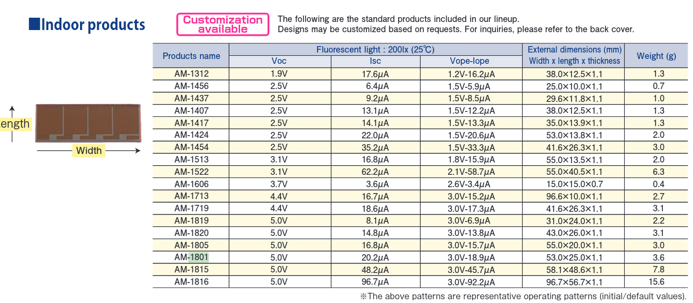

---
title: Some title
panflute-filters: [test_assembly2]
panflute-path: '~/Documents/Uploads/filters'
starting_dir: "~/Documents/Uploads/content"
<!-- panflute-verbose: true -->
...

# heading level 1 in /main.md

**paragraph** in /main.md

note the things in **parts** can be .md files, or *directories* which contain a mian.md

ababa!!

## heading level 2
aaa

### heading level 3
bbb

~~~ parts
my_key_1: my_value_1
my_key_2: my_value_2
---
a_outerfolder
b_outerfolder
c_outerfolder
d_outerfolder
~~~

~~~ comment
quote: Simplicity is the ultimate sophistication.
who: Leonardo da Vinci
---
a_intro
b_aaa
c_dee
d_doo
~~~
