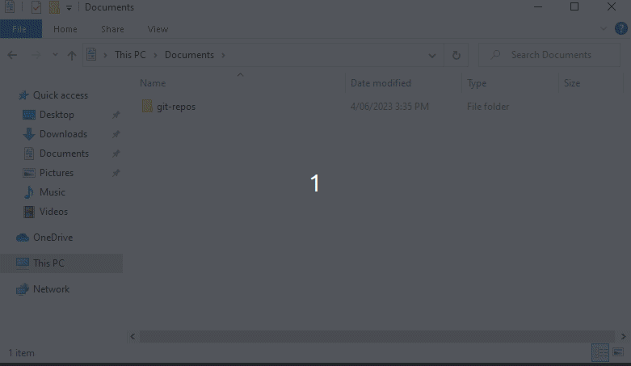
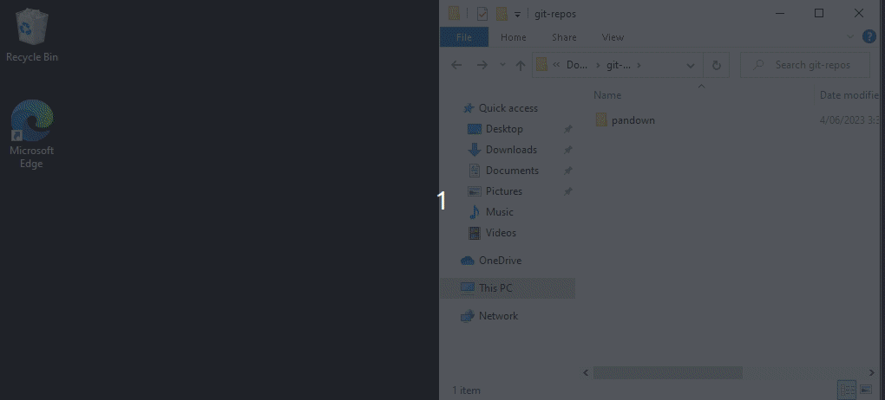
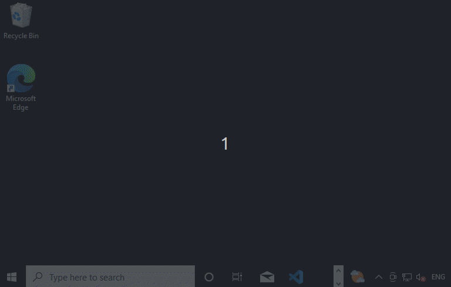
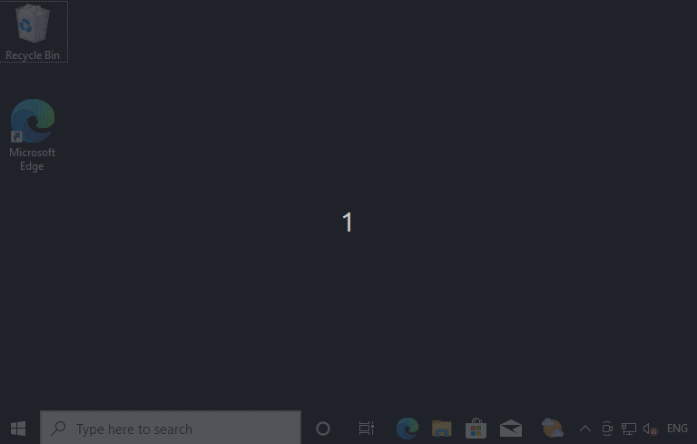
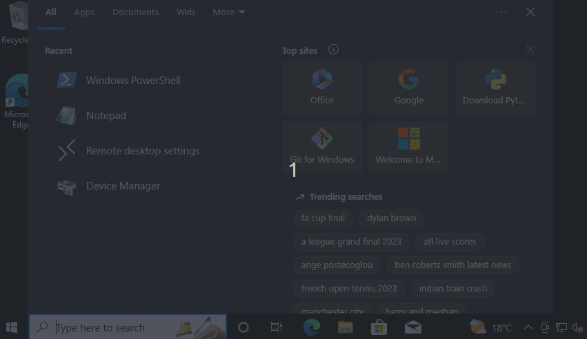
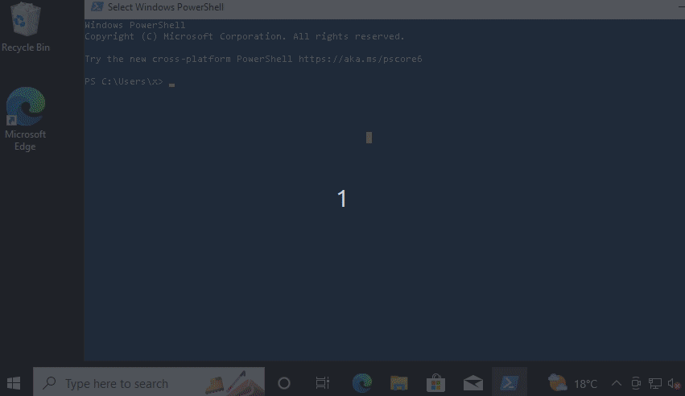
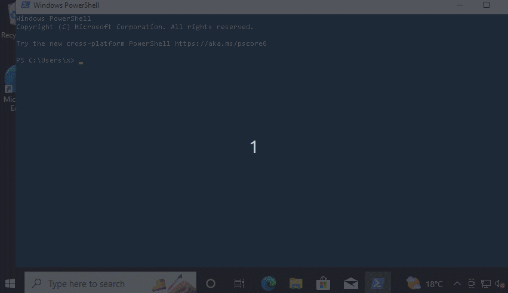

# Installation

## Key concepts

**vscode** is a text editor used for writing text files, and for triggering the document build process

**git** is a software tool with a command line interface for version control. Git is implemented as a repository, and it is currently seen as simplest to have one git repository for each document.

**bitbucket** is an example of a service on the internet that runs git. This is the service refered to as the 'git remote', i.e. the remote server that implements a git image of your project.

**private key, public key** are two parts of the SSH encryption process commonly used by git that, when set up, will allow us to use git to interact over a network without having to enter a password each time

**gitk** is a software tool with a graphical interface for visually inspecting the status of the git repository on your computer

**project directory** is the root directory of this repository, and is the reference location for files when paths are specified. For example, the location of this file is `doc/installation.md`, which is its relative location from the project directory.

## Previous problems and fixes

- Install python before vscode, if your computer doesn't have python. 
	- An issue was once observed where vscode found a weird version of python, which caused failures.
- If you want to open a markdown preview of this file, open this file in vscode and right-click this file's tab, and click `Open preview`
- Some errors can be fixed by re-opening vscode using 'run as admin'.

## Initial procedure to set up and run tests

1. If not already installed, install python using this [download link](https://www.python.org/downloads/). When in the installer, ensure the `Add Python 3.xx to PATH` checkbox is ticked. When installation finishes, an option to `Disable path length limit` will appear, click this button to disable path length limit. Not doing this may otherwise cause issues later on.

2. If not already installed, install git using this [download link](https://gitforwindows.org/), changing the default text editor to notepad, and setting the default new branch name to 'main', keeping all other default settings.

3. Using git, clone this repository to a folder on your computer.

	1. Open a new folder in file explorer where you'd like to save a copy of this repository, then right-click in the whitespace and click `Git Bash Here`. A black window will open.
	2. Type or paste `git clone https://github.com/dicethrow/pandown.git`, then press enter. This will download the repository to your computer. Close the git bash window.
	
	A new folder should now exist called `pandown`.

	

4. Install pandown with pip

	1. Open the new `pandown` folder, then open `python_lib`
	2. Open a powershell window, type `cd`, then type a space, then drag the `python_lib` folder into powershell in order to copy the path of the folder. Press enter in powershell, this will make powershell's current directory be the specified directory.
	3. In powershell, type `pip install -e .`. This will install pandown using pip, which is the tool python uses to manage packages.

	

5. Install vscode [Download link](https://code.visualstudio.com/download)

	1. Once installed, open vscode, then navigate to the extensions window. Type in `python`, and for the first result, click `install`. This will enable the vscode text editor to interact with python files better. This may take up to a minute or so.

	

6. Install panflute with pip

	This is a library used by pandown.

	In powershell, type `pip install panflute`, then press enter.

	

7. Install pandoc from this [download link](https://pandoc.org/installing.html)

8. Install latex

	- Windows:
		- install as miktex from this [download link](https://miktex.org/download)
		- When it asks 'install missing packages on the fly' click 'yes'.

## Procedure to link to git remotes, for common workflows

1. Set up a SSH key on your computer, and copy the public key to your clipboard.

	- On windows

		1. In the search box on the taskbar, type 'powershell'. One program should match it, run it. A blue window with a command line interface (CLI) will open.

		

		2. Type the command 'ssh-keygen', and press enter, this will execute the ssh-keygen program.
		Several prompts will be printed to screen, press enter for each one, which will select the default options. 

		
		
		One line should print something like this: `Your public key has been saved in C:\Users\USERNAME/.ssh/id_rsa.pub.` 
		
		3. Open the file referred to in a text editor and copy the contents.
		You can do this by typing this command in the powershell window: `notepad C:\Users\USERNAME/.ssh/id_rsa.pub`, where you should use the path printed to screen on your terminal. A text editor should open, showing one long line of text. Press ctrl-A to select all, then ctrl-c to copy the text.

		

	- On mac
		- x 
	- On linux
		- x

2. Link your SSH key link it to your git remote service.

	- If you use bitbucket,

		1. Open bitbucket, navigate to personal settings, then to ssh keys. 
		
		2. Click Add SSH key, and paste the contents of the file you opened in the previous step.

	- If you use aws codecommit,
		...