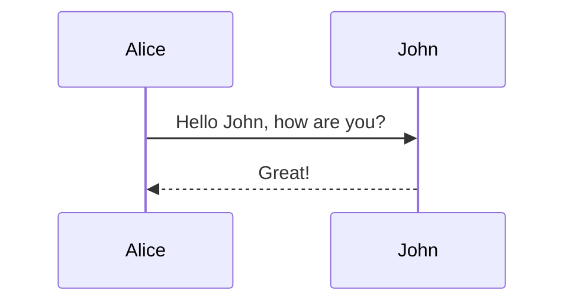
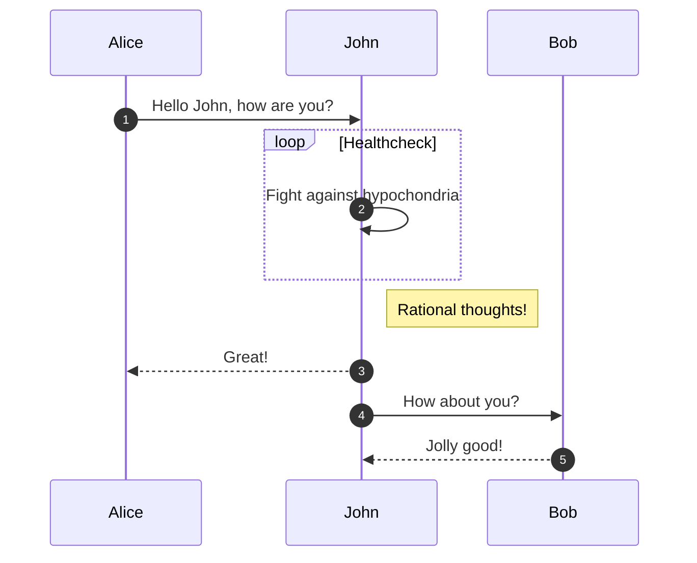
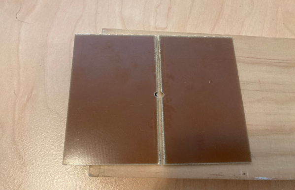

<!-- # Heading level 1 (should become 2) in content/a_outerfolder/main.md -->
# heading level 1 xxxx

Content below that heading in the markdown file

xxx change

let's see if this *mermaid* filter works. Should look like the example from https://github.com/raghur/mermaid-filter

Now let's try another, this one from here: https://stackoverflow.com/questions/68561397/mermaid-syntax-error-on-trying-render-a-diagram-on-github-md-file

now let's add an image

